# GraphALP: Graph-Based Active Learning & Label Propagation

[](#)
[](#)
[](#)
[](#)

**GraphALP** is an elegant, educational, and high-performance Python package for graph-based semi-supervised learning and active learning. Built on top of **NetworkX** and **NumPy**, it provides clean API implementations of standard label propagation algorithms and geometric/uncertainty active learning query strategies. 

The package is accompanied by a **Premium Interactive HTML Visualization Dashboard** hosted on GitHub Pages, where you can watch labels propagate and samplers select queries in real time.

---

## 🌟 Key Features

*   **Label Propagation**: Four propagation models ranging from classic Gaussian random fields to graph convolutional message passing.
*   **Active Learning Samplers**: Four active sampling query strategies designed to query the most informative nodes under cost constraints.
*   **Mathematical Cleanliness**: Transparent and concise NumPy/NetworkX implementations directly reflecting the underlying research formulations.
*   **Visual Demonstrations**: Embeddable GIFs, matplotlib curves, and a live web simulator canvas for interactive learning.

---

## 🎬 Visual showcases (Algorithms in Action)

### Label Propagation Algorithms

Below is a visual comparison of how label representations propagate from initial seeds (Mr. Hi in Blue, John A in Red) across a Stochastic Block Model (SBM) network structure:

| Harmonic Propagator | Min-Cut Propagator |
| :---: | :---: |
| 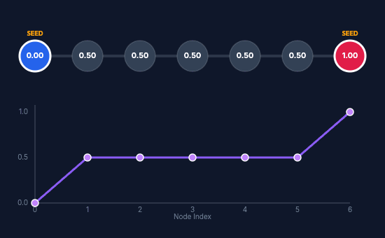 | 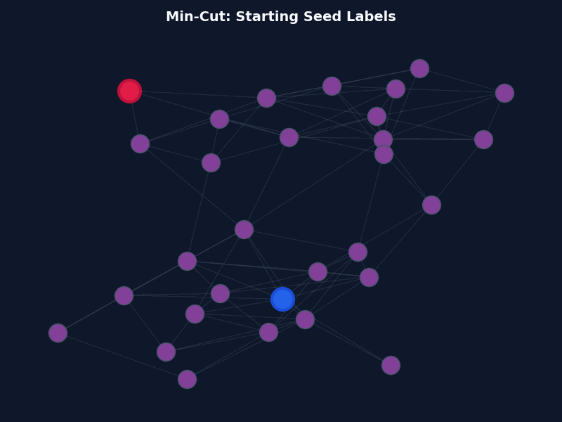 |
| Dirichlet formulation; continuous probability diffusion. | Min-capacity cut; hard combinatorial partitions. |

| Spectral Propagator | GCN Propagator |
| :---: | :---: |
| 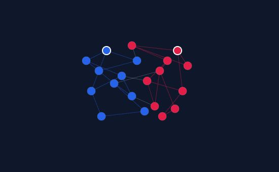 | 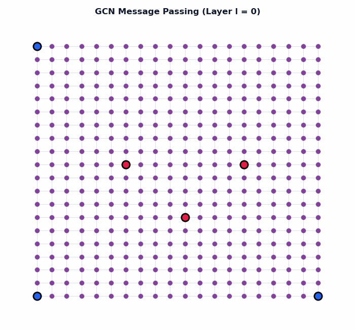 |
| Laplacian eigenvector projection + SVM classifier. | Symmetric normalized adjacency convolutions. |

### Active Learning Samplers

Watch how active learning samplers query unlabeled nodes to quickly resolve boundary uncertainty:

| Harmonic Greedy Sampler (ERM) | S2 Sampler (Dasarathy et al.) | FeatProp Sampler (K-Medoids) |
| :---: | :---: | :---: |
| 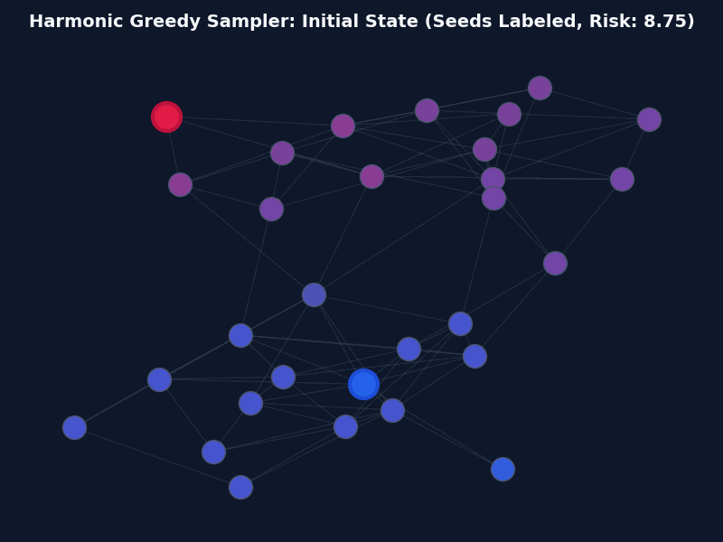 | 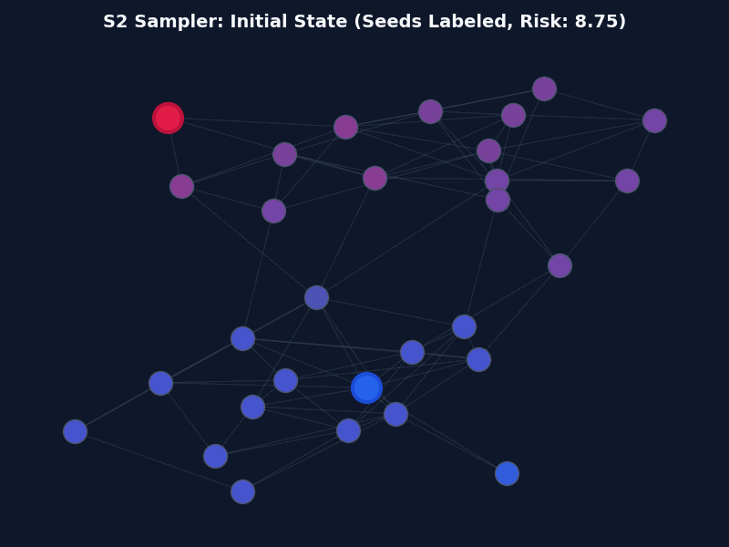 | 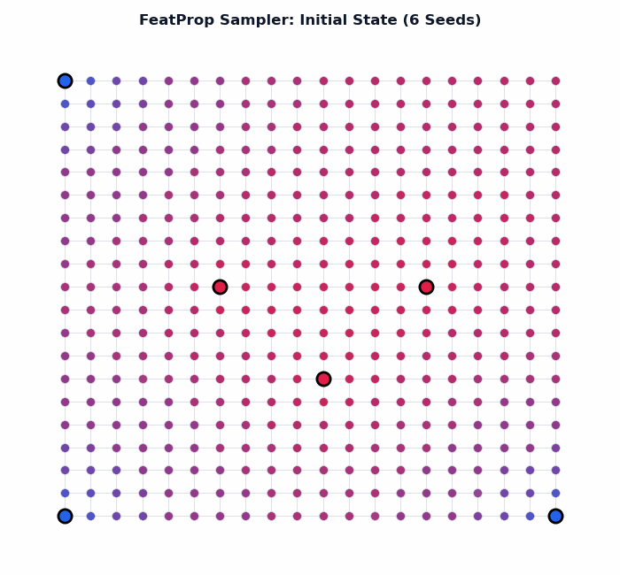 |
| Minimizes graph-wide expected risk. | Bisects geodesic shortest paths. | Propagates features + K-Medoids. |

---

## 🛠 Installation

To install **GraphALP** in development mode:

```bash
# Clone the repository
git clone https://github.com/username/graph-alp.git
cd graph-alp

# Install the package and its dependencies
pip install -e .
```

### Dependencies
*   `numpy >= 1.20`
*   `networkx >= 2.6`
*   `scikit-learn >= 1.0` (for Spectral/SVM embeddings)
*   `matplotlib` (for running examples and generating benchmarks)

---

## 🚀 Quick Start

### 1. Label Propagation Example

Predict labels of unlabeled nodes using the Gaussian random field formulation (`HarmonicLabelPropagator`):

```python
import networkx as nx
from graphalp import HarmonicLabelPropagator

# 1. Create a graph (e.g., Zachary's Karate Club)
G = nx.karate_club_graph()

# 2. Define initial labeled seeds
# Node 0 -> Class 0 (Mr. Hi), Node 33 -> Class 1 (John A)
X_labeled = [0, 33]
y_labeled = [0, 1]

# 3. Fit the Harmonic Label Propagator
propagator = HarmonicLabelPropagator(G)
propagator.fit(X_labeled, y_labeled)

# 4. Predict probabilities and classes for unlabeled nodes
unlabeled_nodes = [n for n in G.nodes() if n not in X_labeled]
probs = propagator.predict_probabilities(unlabeled_nodes)
predictions = propagator.predict(unlabeled_nodes)

# Display a subset of predictions
for node, prob, pred in list(zip(unlabeled_nodes, probs, predictions))[:5]:
    print(f"Node {node:2d}: Prob={prob:.4f} -> Predicted Class={pred}")
```

### 2. Active Learning Query Example

Intelligently query nodes using the expected risk minimization strategy (`HarmonicGreedySampler`):

```python
import networkx as nx
from graphalp import HarmonicGreedySampler

# 1. Create a graph
G = nx.karate_club_graph()

# 2. Start with minimal initial labels
X_labeled = [0, 33]
y_labeled = [0, 1]

# 3. Instantiate the Active Sampler
sampler = HarmonicGreedySampler(G)

# 4. Run an active learning query loop
for step in range(5):
    sampler.fit(X_labeled, y_labeled)
    
    # Query the node that minimizes graph-wide expected risk
    next_node = sampler.sample()
    if next_node is None:
        break
        
    # Query the oracle / obtain true label (mocked here based on node ID parity)
    true_label = 0 if next_node % 2 == 0 else 1
    
    # Update labeled set
    X_labeled.append(next_node)
    y_labeled.append(true_label)
    
    print(f"Query Step {step+1}: Selected Node {next_node} (Oracle Label: {true_label})")
```

---

## 📊 Benchmark Simulations

Under the `examples/` directory, you can find benchmark scripts comparing performance curves (graph uncertainty vs. classification accuracy) over multiple query steps. 

Below are the quantitative benchmark results comparing sampler performance across all 5 test graphs:

<details>
<summary><b>📈 Graph 1: Grid Columns (Left vs. Right Community)</b></summary>

| Topology & Seeds | Expected Risk Reduction | Prediction Accuracy |
| :---: | :---: | :---: |
| 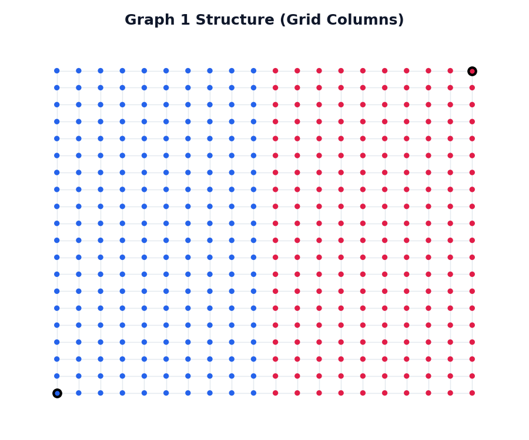 | 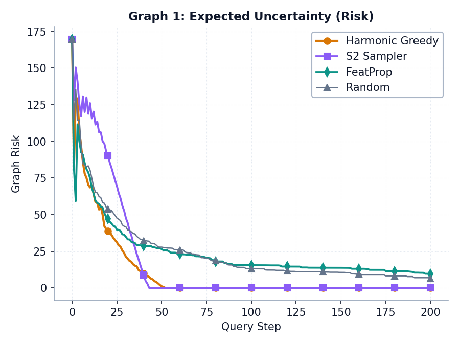 | 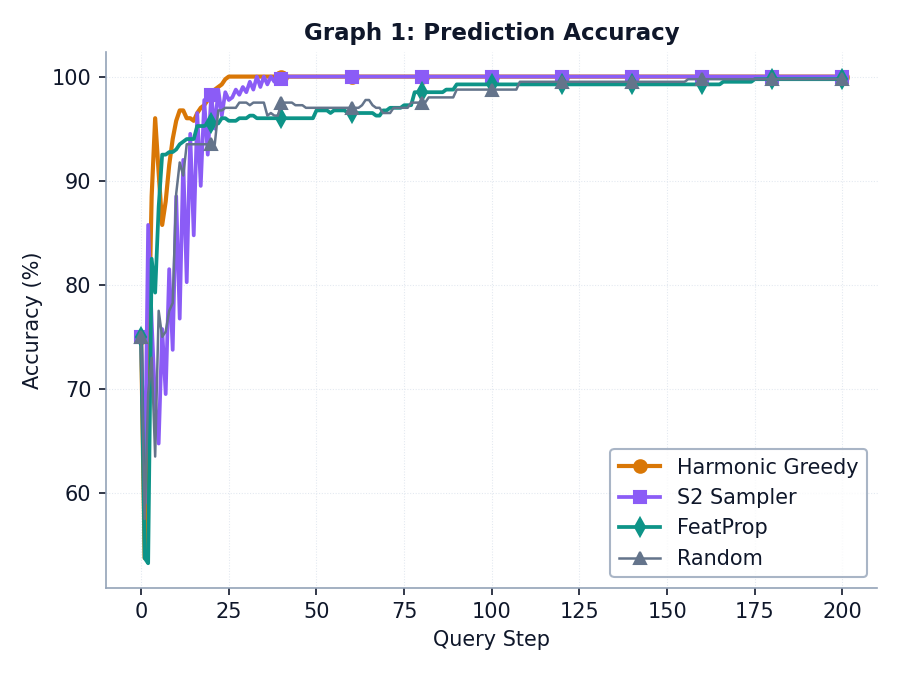 |

</details>

<details>
<summary><b>📈 Graph 2: Grid Rows (Top vs. Bottom Community)</b></summary>

| Topology & Seeds | Expected Risk Reduction | Prediction Accuracy |
| :---: | :---: | :---: |
| 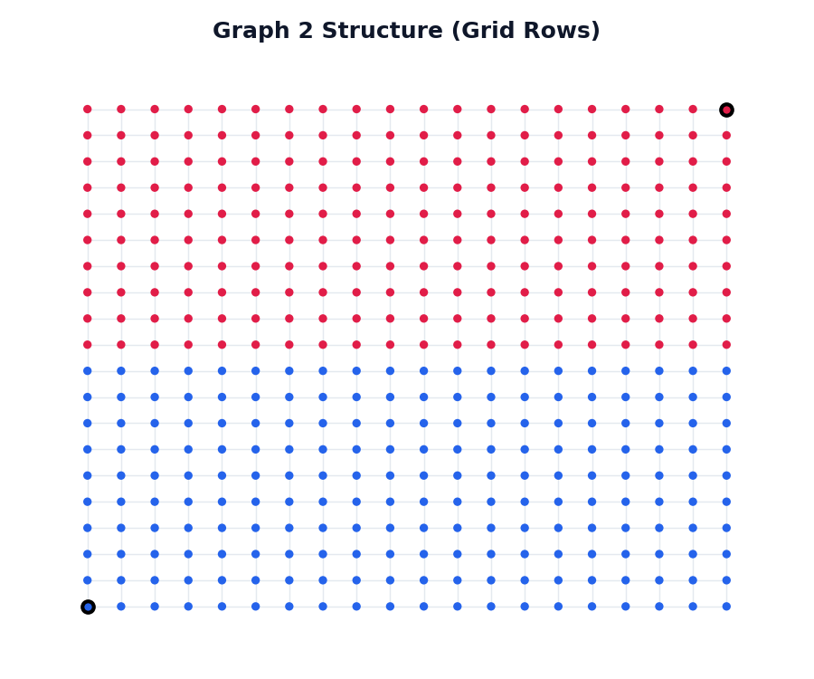 | 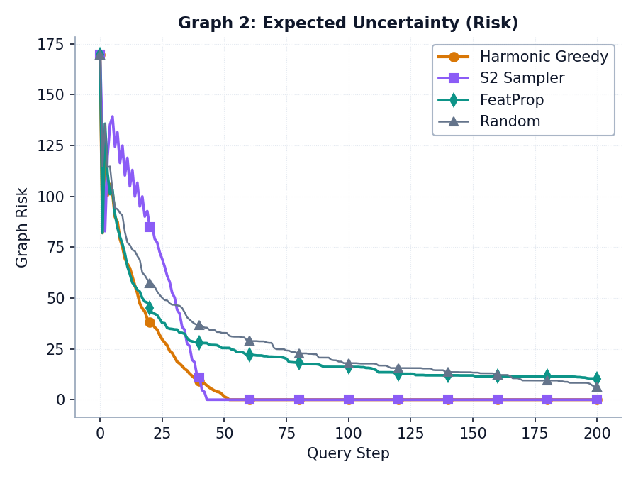 | 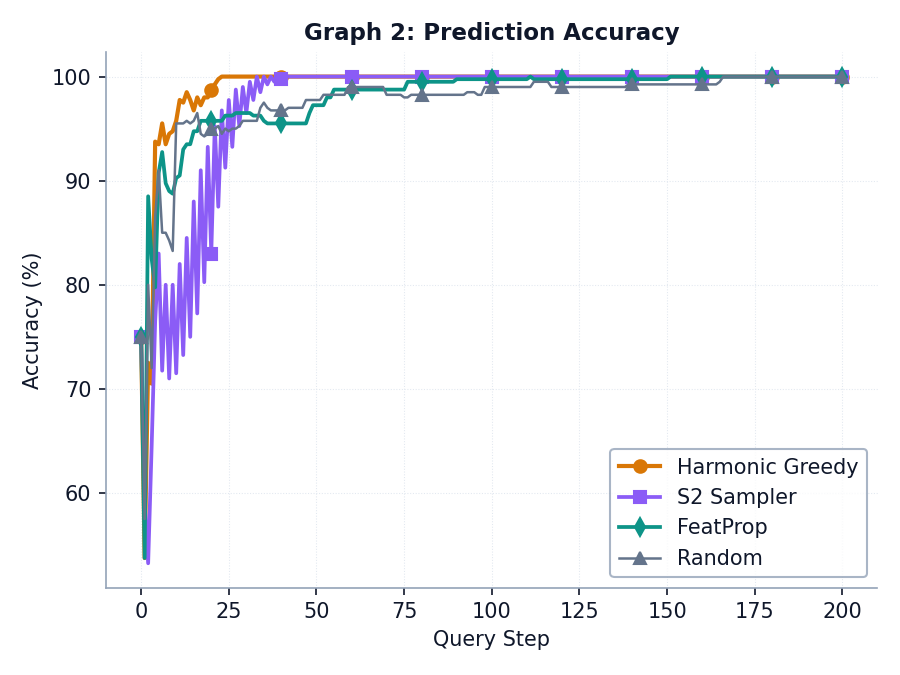 |

</details>

<details>
<summary><b>📈 Graph 3: Diagonal Circles</b></summary>

| Topology & Seeds | Expected Risk Reduction | Prediction Accuracy |
| :---: | :---: | :---: |
| 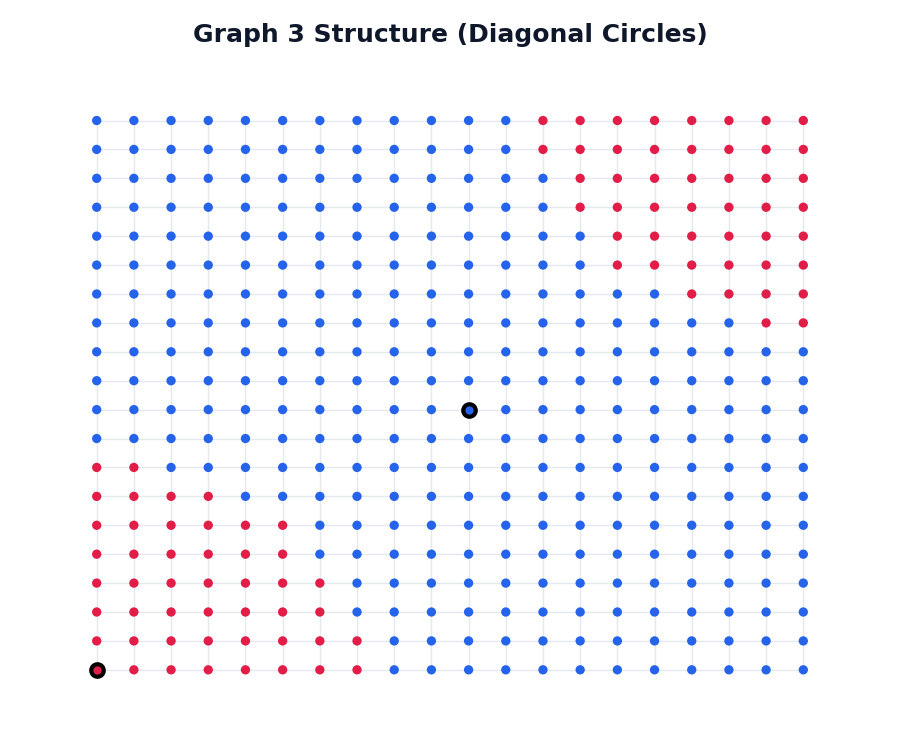 | 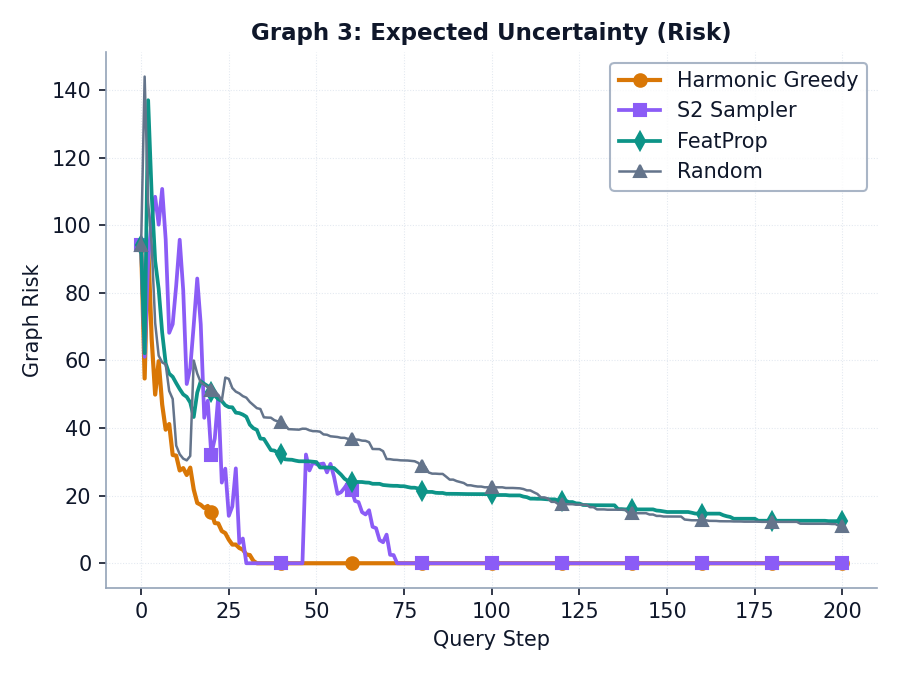 | 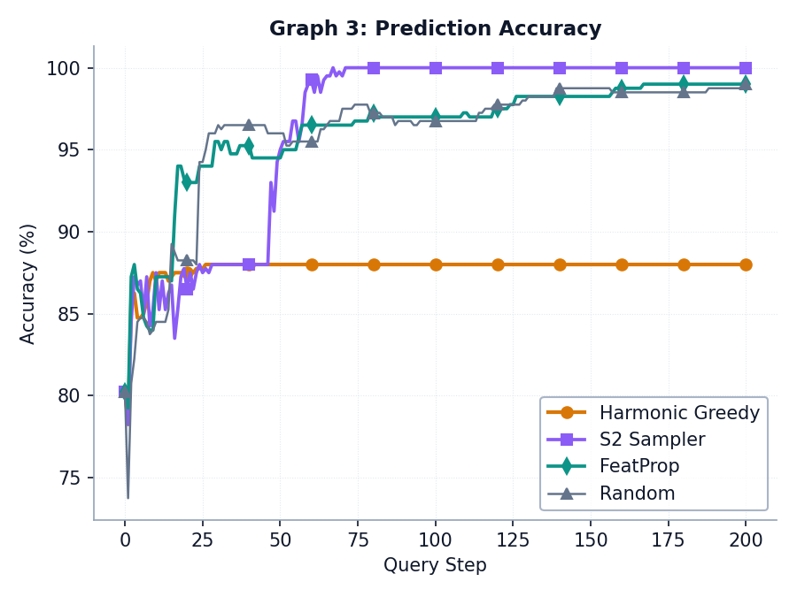 |

</details>

<details>
<summary><b>📈 Graph 4: Off-Diagonal Circles</b></summary>

| Topology & Seeds | Expected Risk Reduction | Prediction Accuracy |
| :---: | :---: | :---: |
| 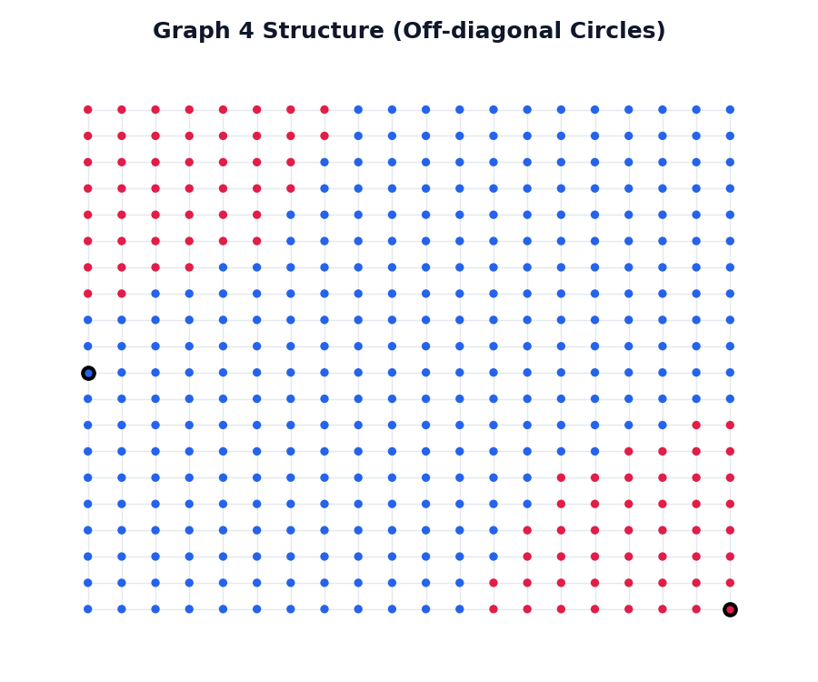 | 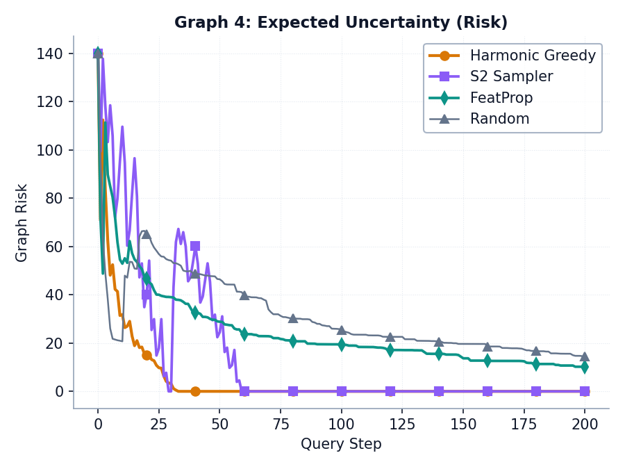 | 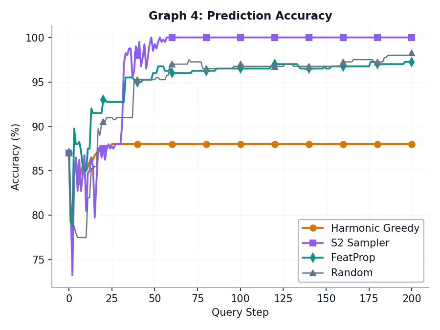 |

</details>

<details>
<summary><b>📈 Graph 5: Clustered SBM (40-Node Stochastic Block Model)</b></summary>

| Topology & Seeds | Expected Risk Reduction | Prediction Accuracy |
| :---: | :---: | :---: |
| 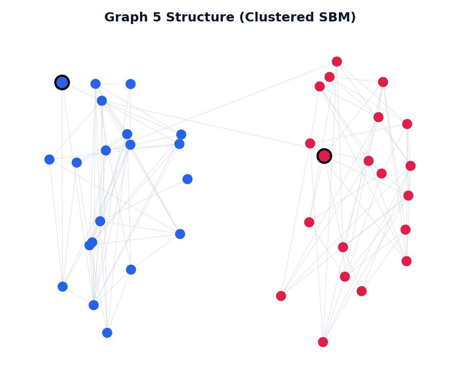 | 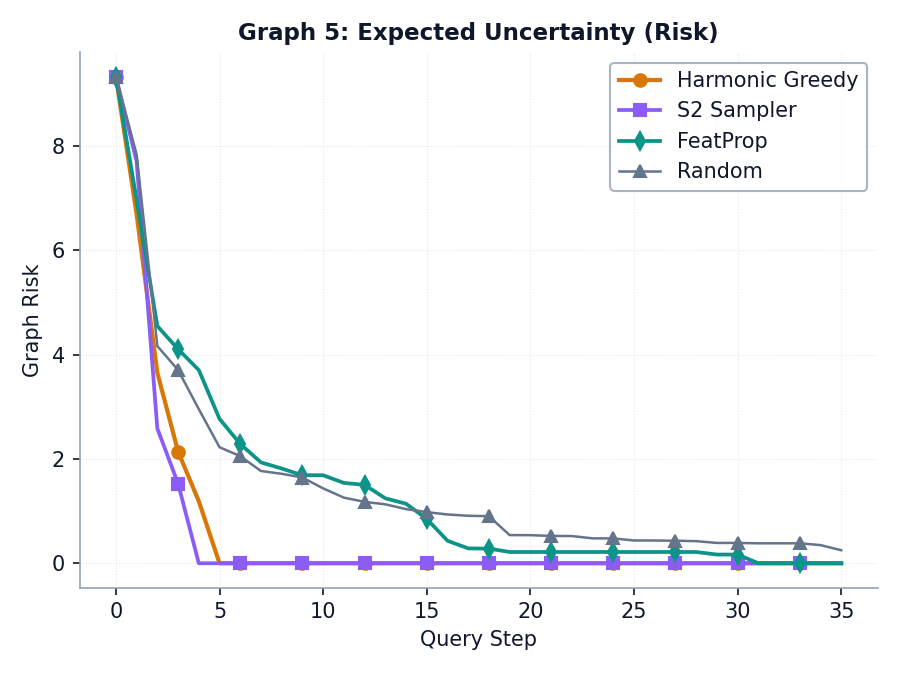 | 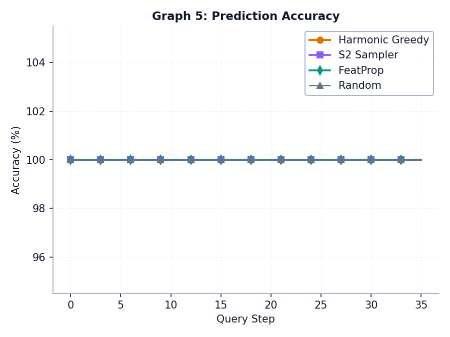 |

</details>

As shown above, active samplers like **Harmonic Greedy** and **FeatProp** consistently outperform the **Random** baseline by targeting bottleneck boundary nodes and representative cluster centroids.


---

## 📂 Repository Structure

*   `src/graphalp/`: Core library package files.
    *   `__init__.py`: Package entrypoint exposing propagators and samplers.
    *   `label_propagation.py`: Implementation of `Harmonic`, `MinCut`, `Spectral`, and `GCN` propagators.
    *   `active_learning.py`: Implementation of `HarmonicGreedy`, `S2`, `FeatProp`, and `Random` samplers.
    *   `utils.py`: Risk assessment and mathematical helpers.
*   `docs/`: Interactive visual showcase code & documentation pages.
    *   `index.html`: Interactive Visualizer Dashboard.
    *   `docs.html`: Complete API reference and implementation docs.
    *   `gifs/` & `images/`: Visualization animations and benchmark charts.
*   `examples/`: Jupyter notebooks and python scripts displaying advanced usage.
*   `tests/`: Unit test suite (empty placeholder).

---

## 📖 Research Citations

*   **Harmonic Functions**: Xiaojin Zhu, Zoubin Ghahramani, and John Lafferty. *"Semi-Supervised Learning Using Gaussian Fields and Harmonic Functions"*, ICML 2003.
*   **Graph Mincuts**: Avrim Blum and Shuchi Chawla. *"Learning from Labeled and Unlabeled Data using Graph Mincuts"*, ICML 2001.
*   **GCN Convolutions**: Thomas N. Kipf and Max Welling. *"Semi-Supervised Classification with Graph Convolutional Networks"*, ICLR 2017.
*   **S2 Sampler**: Gautam Dasarathy, Robert Nowak, and Xiaojin Zhu. *"S2: Active Learning on Graphs with Vertex Cut Constraints"*, NIPS 2015.
*   **FeatProp Sampler**: Yuexin Wu et al. *"Active Learning for Graph Neural Networks via Node Feature Propagation"*, NeurIPS GRL Workshop 2019.

---

## 📄 License

This project is licensed under the MIT License - see the LICENSE file for details.